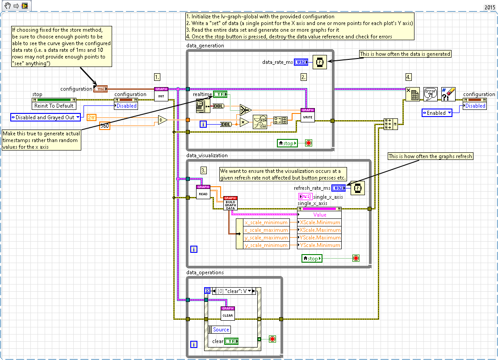
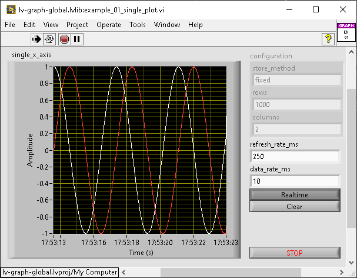
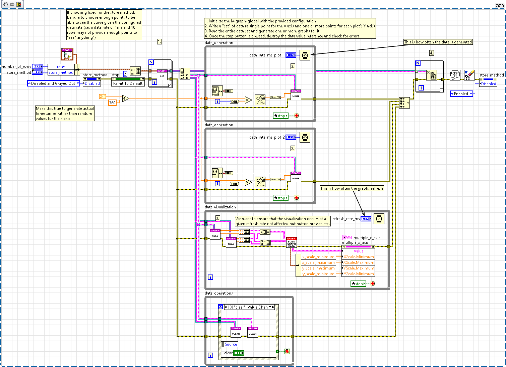
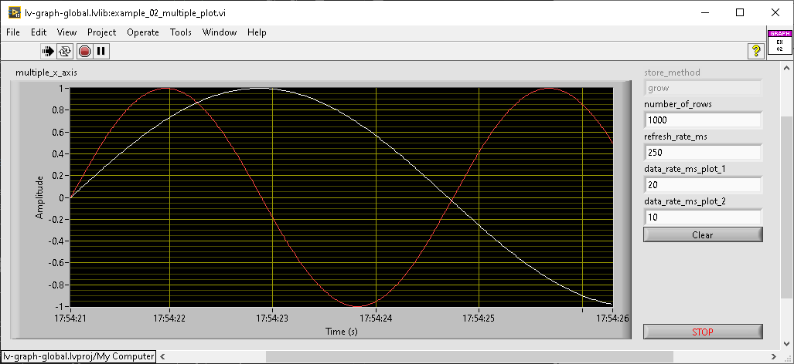
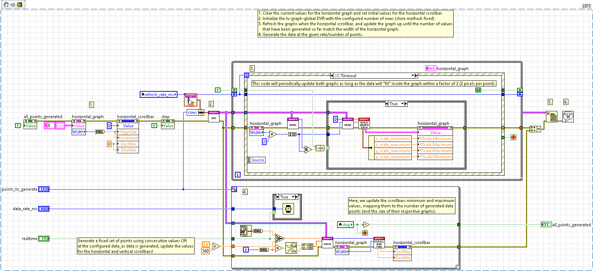
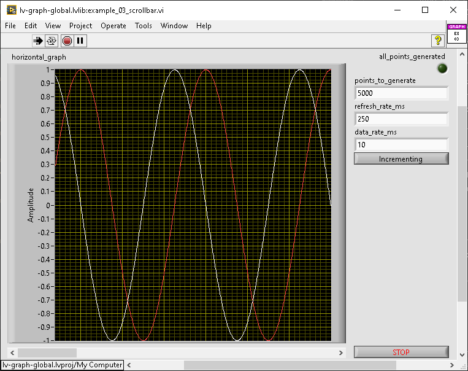

# lv-graph-global

lv-graph-global provides a solution to simplify management of data for XY graphs; it takes the easier route to manage multiple plots by managing multiple DVRs but using the same API. It provides enough functionality to ONLY allow a single X axis (per DVR).

## Description

the lv-graph-global can be configured to provide a variety of functionality:

* store_method: the store method can be (1) fixed, where the total number of points is fixed for the X axis and the Y axis or (2) grow, where the total number of points will grow by the pre-configured number of rows/columns each time the number of rows have been exceeded.
* rows: this configures the number of rows (total number of points for the X axis or the number of "arrays" of items added to the Y axis).
* columns: the total number of points added at one time for the Y axis.

lv-graph-global provides a handful of API:

* initialize.&#8203;vi - provides the ability to create a DVR for the graph-global, can be done using configuration (initialize-configuration.&#8203;vi) or data (initialize-data.&#8203;vi)
* read.&#8203;vi - provides the ability to extract data from the DVR as data (read-data.&#8203;vi) or just to read the index (read-index.&#8203;vi)
* write.&#8203;vi - provides the ability to add data to the DVR using point (write-point.&#8203;vi) which adds a single value to the X axis and one or more values to the Y axis and (write-set.&#8203;vi) which can write a set of data to the DVR.
* clear.&#8203;vi - provides the ability to clear all of the data from the internal DVR.

## Example 01 - Single Plot (single X axis)

This example shows two plots sharing the same X axis, one being a sine wave and the other being the cosine wave. Depending on the configuration provided, you can see how the data changes.

Using the store method of fixed, once enough time has passsed, you'll should observe that the number of points doesn't change, but the graph will move to the left (as existing data is replaced with new data). If running for a an incredible amount of time, the overall memory usage should NOT increase.

Using the store method of grow, throughout the entire runtime, you should see the graph grow indefinitely until the sine wave is harder to "see". If running for an incredible amount of time, the overall memory usage SHOULD increase each time the toal number of rows grows by the configured amount (i.e. memory increase should happen every time the number of points grows by the configured number of rows).

## Example 02 - Multiple Plots

This exmaple is kind of boring and just shows the expected implementation when multiple plots are needed. In this example, they share the same X axis, and by default, the configuration of grow will ensure that the data doesn't look weird or disjointed. The default configuration has one plot with a data rate twice as fast as the other plot.

If the data is configured to be fixed instead of grow, the default data rate will ensure that the fixed plot (red) will eventually look weird in that it only takes up half of the plot because it's running twice as fast as the other plot hence the x axis only being half as used.

## Example 03 - Scrollbar

This example shows how the scrollbar can be used to show data (without decimation) with a scrollbar to show the total amount of data dynamically. You'll notice that as data points are generated, the graph is populated up until the number of points generated equal the width of the XY graph, and then the scrollbar should begin to grow.

