# lv-graph

lv-graph contains a handful of VIs that provide functionality to manage data displayed within an XY graph via paging and decimation. It has a number of functions that provide the ability build the graphs in a single plot, multi-plot of vertical plots.

## Description

Almost all of the functions are made to interact with an XY graph (in contrast with a chart or waveform graph). Although the patterns for operating on graphs are fairly common, they should simplify integration/implemenation and reduce repetitive code.

lv-graph seeks to simplify operating with graph using functions to convert x/y data to a specific kind of graph, interacting with cursors, interacting with scrollbars and decimation.

lv-graph provides a handful of API:

* build_graph.vi - This is a polymorphic VI that provides three ways to build XY graphs: (1) single x axis, (2) multiple x axis and (3) verticalstrip graph. It will take an array of doubles and transform it into data appropriate for an XY graph.
* cursor_add.vi - This VI can be used to append or update a single cursor indexed by the active_cursor element.
* cursor_copy.vi - This VI can be used to copy the configuration of a given cursor indexed by active_cursor.
* cursor_move.vi - This VI provides the ability to move an active cursor (providing the X and Y values) indexed by the active cursor input.
* decimate&#46;vi - This VI will decimate a given dataset, following the rule that you can display, at most two points per pixel per plot. If thenumber of points exceeds the number of pixels (wired from height_width). For decimation, it'll group equal sets of points (except the last set)for data representation. As configured, the way the points are represented can be configured as follows: (1) average: this will get the mean ofthe points per group (2) min_max will average the min/max values for the group (3) max: will return the max value, (4) min: will return the minvalue, (5) first will return the first value and (6) last will return the last value.
* scrollbar_index.vi - This VI will relegate scrollbar values with the data available and what's visible on the graph.
* scrollbar_min_max.vi - This VI can be used to determine the min/max values for the scrollbars to represent a given data set.
* xy_graph_copy_format.vi - This is a polymorphic VI that can be used to "copy" the format of a source graph to a destination graph, it'll copyitems such as: (1) LegNumRows, (2) Y/XScale Range for every plot and (3) The plot name/color for each plot.
* create_graph_horizontal.vit - this is a template that can be used to generate a "copy" of a horizontal graph for display/image saving purposes.
* create_graph_vertical.vit - this is a template that can be used to generate a "copy" of a vertical graph for display/image saving purposes.

## Example 00 - Excessive Data

This is a simple example showing how graph's have a memory limitation: you can put more data into memory if you DON'T put it into a graph. Setting data_into_graph to true should generally FAIL causing the VI to crash, but if you don't put it into the graph, you'll see that you can view all of the data as long as you navigate it using the scrollbar.

Keep in mind...it "works" you'll just notice that the VI is super slow and LabVIEW in general is incredibly slow until you clear the data out of the graph. As intended, you'll notice that NOT putting the data into the graph lets you actually run the VI with a reasonable level of functionality.

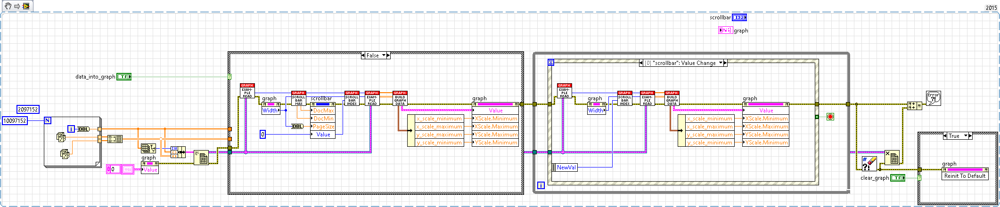

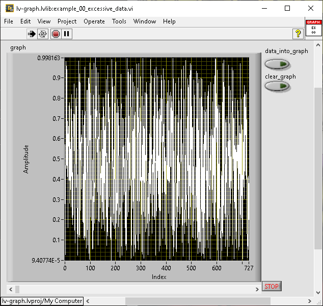

data_into_graph is false

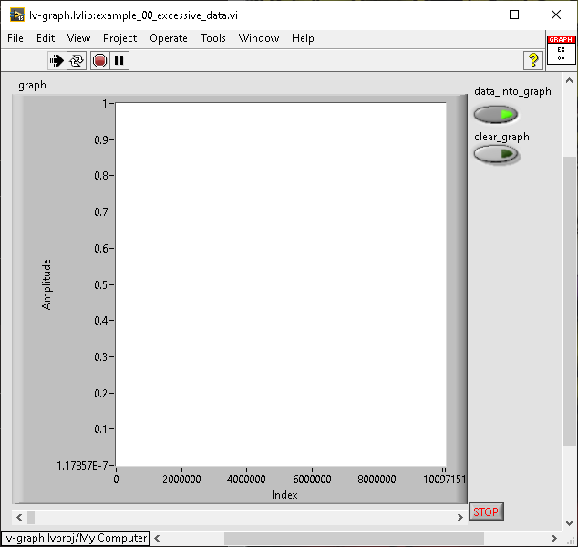

data_into_graph is true

## Example 01 - Build Graph

This is an example meant to showcase different graphs being built from the same/similar data, it shows a single plot, a multi-plot and a vertical strip chart graph. The data rate can be configured and the data grows infinitely. It can be configured for "real-time" data by setting the boolean from Random to Real-time. Note that the multi-plot will fail when realtime is used (because i'm lazy), look deeper to find out why.

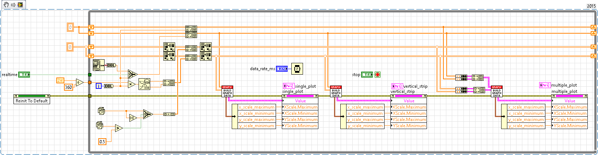

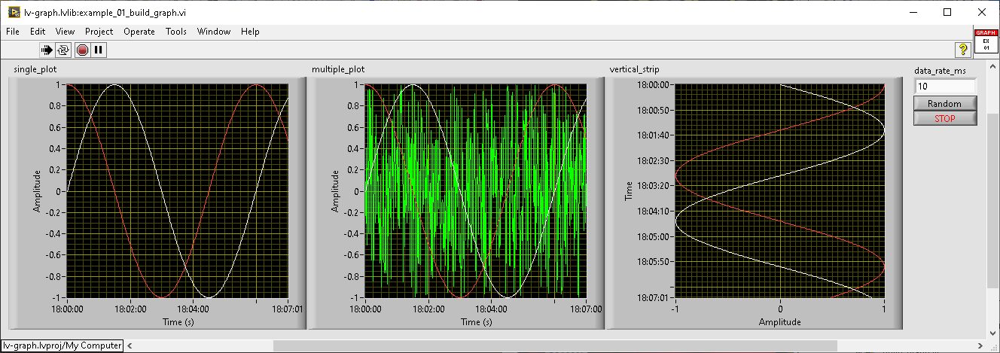
random is true

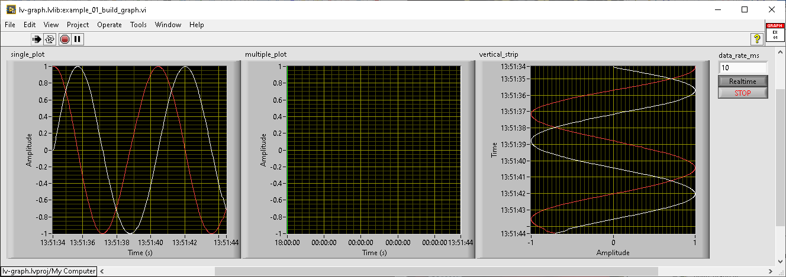
random is false (real-time)

## Example 02 - XY Graph Scrollbar

This example will generate a fixed number of points, and then allow navigation of the data using the hofizontal and vertical scrollbar. You can configure the data rate (how often data is generated) and the refresh rate (how often the graphs update). This is a working example of how to separate data generation from display.

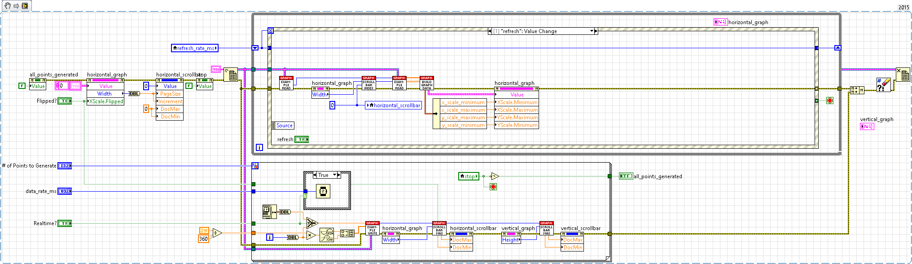
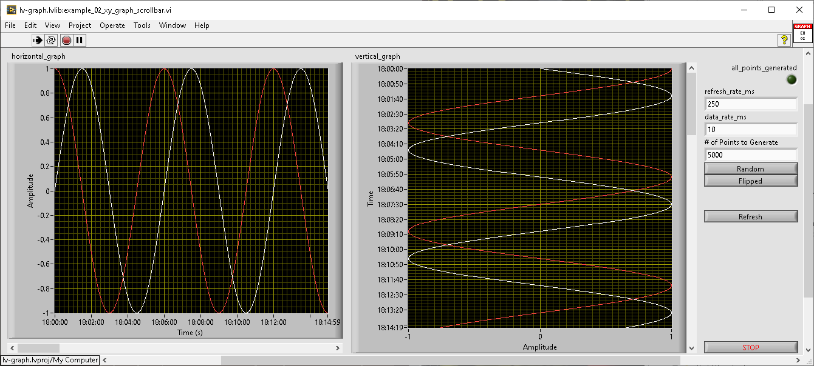

## Example 03 - Decimation

This example showcases how data can be decimated and how the different decimation types can change what data you see. the generated data has some noise added to ensure there are peaks and valleys to decimate.

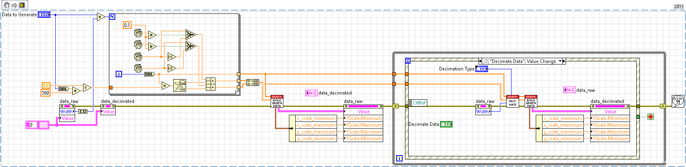

raw data

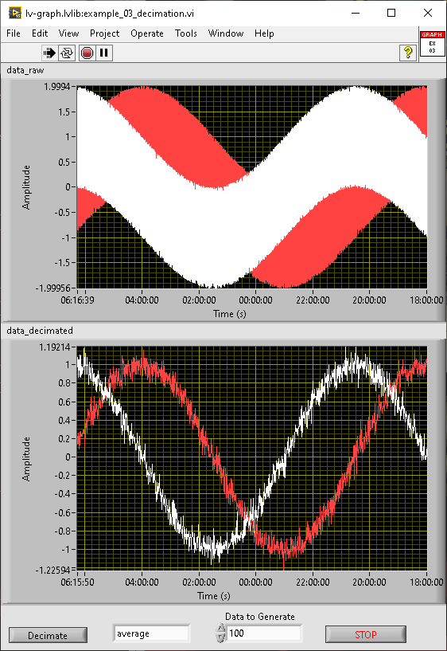

decimation: average

decimation: min/max

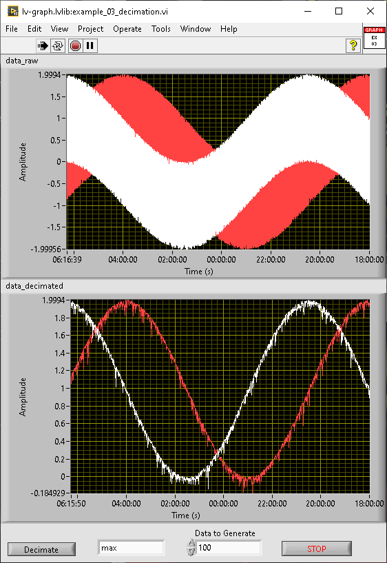

decimation: max

decimation: min

decimation: first

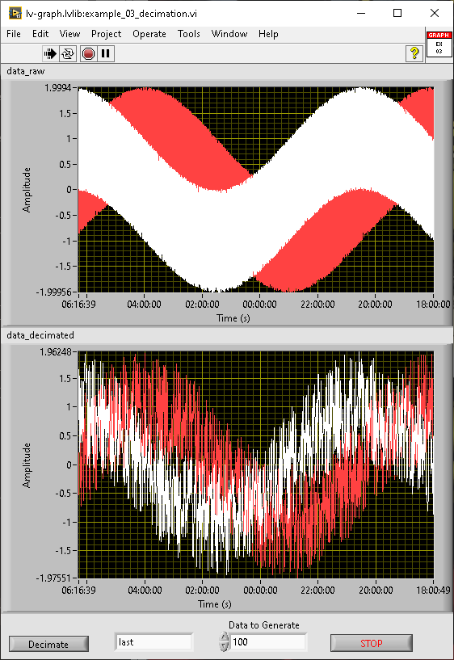

decimation: last

## Example 04 - Create Graph

Create graph shows how to generate data, store it in a graph, create an image of the graph and store it as a file.

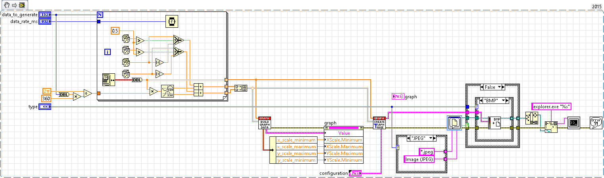

## Example 05 - Make Cursor

This example provides a showcase of the cursor functions that try to simplify basic workflows for interacting with cursors as in creating them, configuring them and moving them.

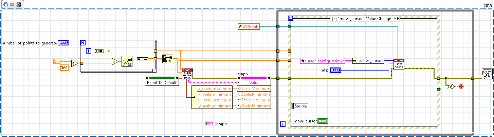
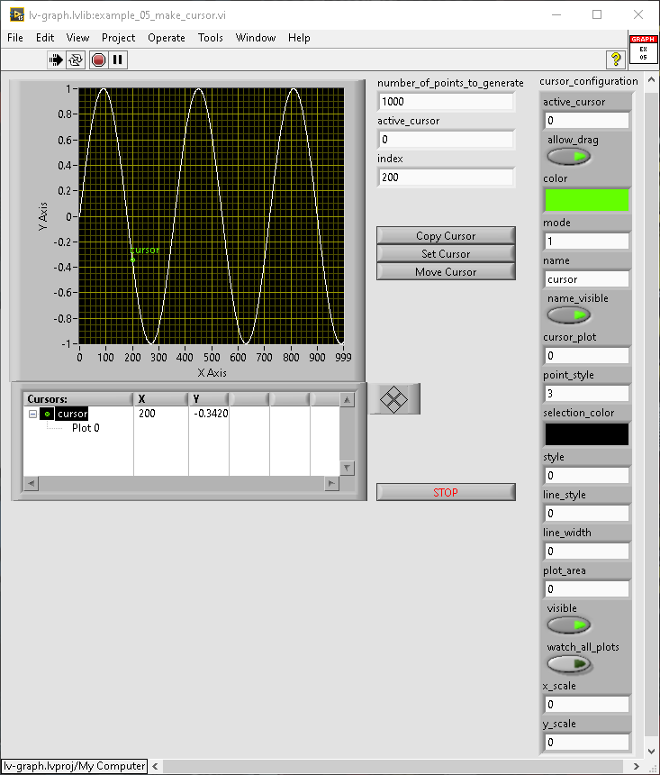
